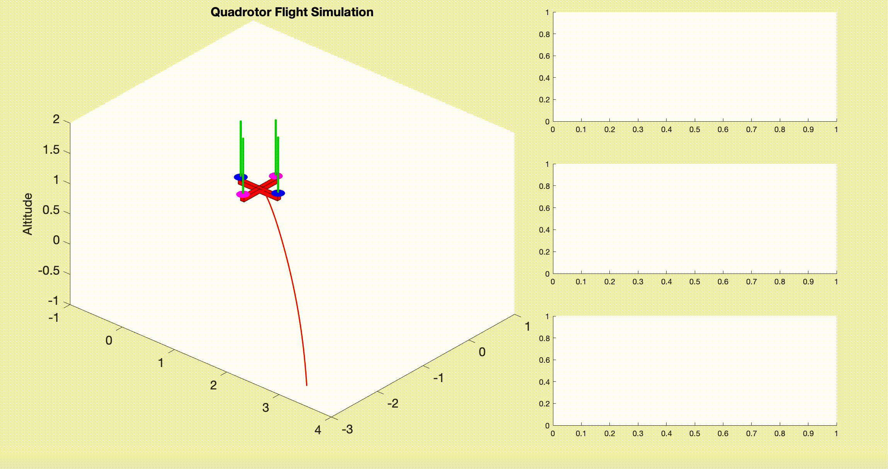
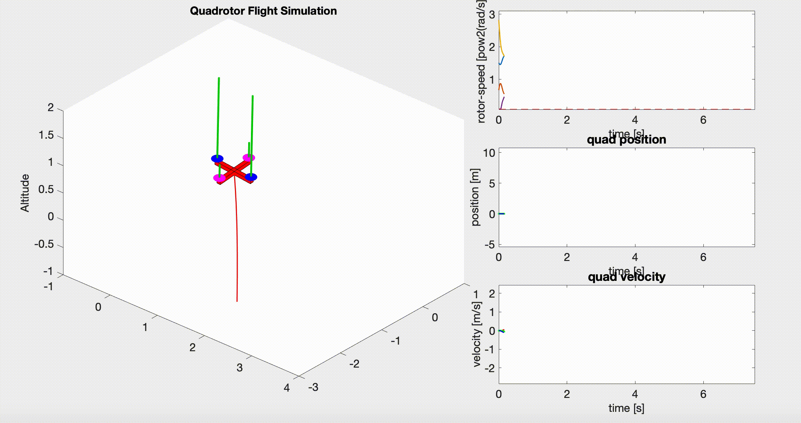

# Path Integral Policy Improvement
This repository contains the implementation of the Path Integral Policy Imporvement (PI2) algorithm [[link]](https://api.semanticscholar.org/CorpusID:1797388) demonstrated by controlling a quadrotor in simulation.

## Algorithm
TODO

## Result
The image below shows tha initialized policy computed using the Iterative Linear Quadratic Controller.

After running the PI2 algorithm on the initial policy, the quadrotor trajectory becomes much smoother. 

